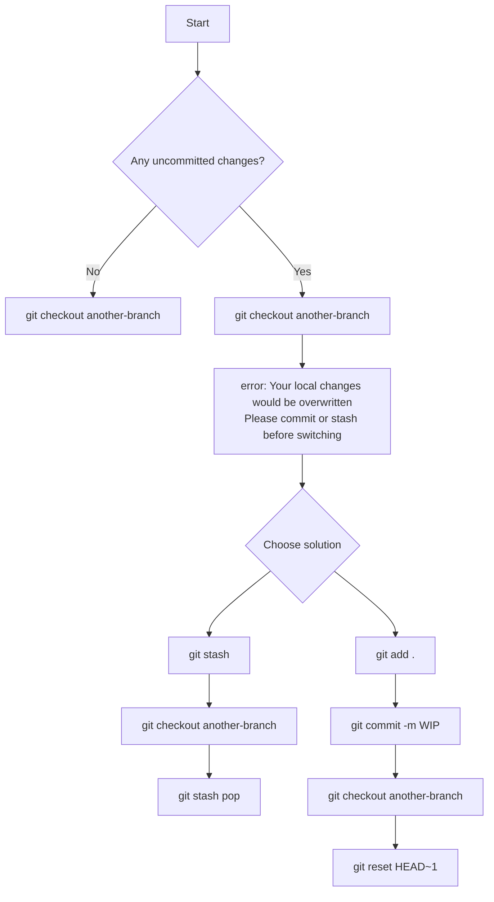

# Git: Switch Branch Without Commit (Safe Guide)

## 📌 Description

Sometimes during development, you modify files but **don’t want to commit yet** — maybe:
- Work is incomplete (WIP)
- You want to test something in another branch
- You need to quickly check or fix something elsewhere

In this situation, Git allows you to switch branches **without committing**, but only under safe conditions.

---

## ⚠️ When Can You Do This?

You can switch branches **without commit** when:

- ✅ The target branch does NOT have conflicting changes in the same file
- ❌ Git WILL BLOCK you if your changes would be overwritten

---

## 🧠 Why This Happens

Uncommitted changes are stored in your:
👉 **Working Directory (not inside the branch yet)**

So:
- Changes are NOT attached to any branch
- They move with you when you switch branches
- Until you commit or stash them

---

## 🔄 Flow Diagram (Simple)



---

## 🛠️ Simple Instructions

### 1. Try switching branch
```bash
git checkout another-branch
```

---

### 2. If it works
✔ Your changes go with you  
✔ Nothing is lost  

---

### 3. If Git blocks you
```bash
error: Your local changes would be overwritten
```

---

### 4. Use stash (Recommended)
```bash
git stash
git checkout another-branch
```

Return later:
```bash
git checkout staging
git stash pop
```

---

### 5. Or use temporary commit
```bash
git add .
git commit -m "WIP"
git checkout another-branch
```

Undo later:
```bash
git reset HEAD~1
```

---

## 🎯 Key Takeaway

> If you don’t commit, your changes are like a bag 🎒  
> They go wherever you go (branch) — unless Git stops you to protect your code.

---

## ✅ Best Practice

- Use **git stash** for temporary switching
- Use **WIP commit** for longer work
- Avoid carrying changes across multiple branches

