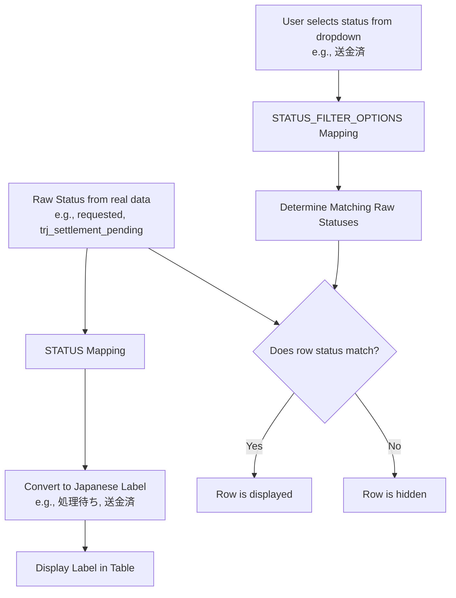
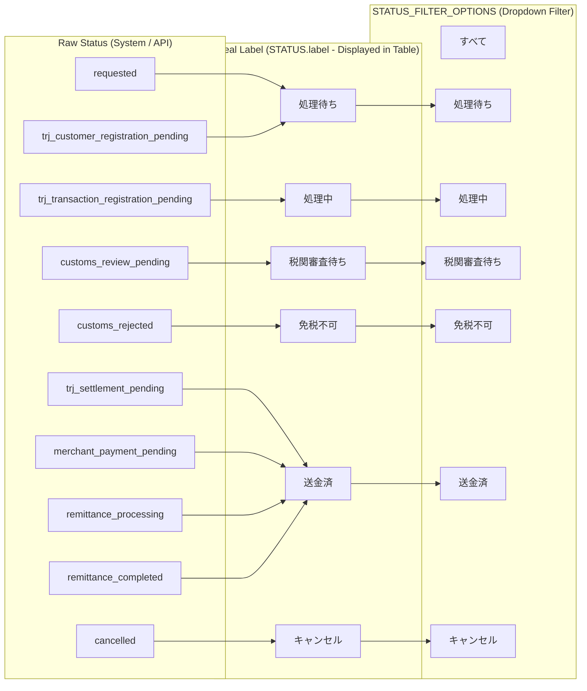

```mermaid
flowchart TD
    A[Raw Status from real data<br/>e.g., requested, trj_settlement_pending]
        --> B[STATUS Mapping]

    B --> C[Convert to Japanese Label<br/>e.g., 処理待ち, 送金済]
    C --> D[Display Label in Table]

    E[User selects status from dropdown<br/>e.g., 送金済]
        --> F[STATUS_FILTER_OPTIONS Mapping]

    F --> G[Determine Matching Raw Statuses]
    G --> H{Does row status match?}

    A --> H

    H -->|Yes| I[Row is displayed]
    H -->|No| J[Row is hidden]
```

```mermaid
flowchart LR
    %% LEFT: Raw System Status
    subgraph L["Raw Status (System / API)"]
        A1["requested"]
        A2["trj_customer_registration_pending"]
        A3["trj_transaction_registration_pending"]
        A4["customs_review_pending"]
        A5["customs_rejected"]
        A6["trj_settlement_pending"]
        A7["merchant_payment_pending"]
        A8["remittance_processing"]
        A9["remittance_completed"]
        A10["cancelled"]
    end

    %% MIDDLE: Real Labels from STATUS.label
    subgraph M["Real Label (STATUS.label - Displayed in Table)"]
        B1["処理待ち"]
        B2["処理中"]
        B3["税関審査待ち"]
        B4["免税不可"]
        B5["送金済"]
        B6["キャンセル"]
    end

    %% RIGHT: Dropdown Filter Options
    subgraph R["STATUS_FILTER_OPTIONS (Dropdown Filter)"]
        C0["すべて"]
        C1["処理待ち"]
        C2["処理中"]
        C3["税関審査待ち"]
        C4["免税不可"]
        C5["送金済"]
        C6["キャンセル"]
    end


    %% Mapping: Raw Status -> Real Label
    A1 --> B1
    A2 --> B1
    A3 --> B2
    A4 --> B3
    A5 --> B4
    A6 --> B5
    A7 --> B5
    A8 --> B5
    A9 --> B5
    A10 --> B6

    %% Mapping: Real Label -> Filter Option
    B1 --> C1
    B2 --> C2
    B3 --> C3
    B4 --> C4
    B5 --> C5
    B6 --> C6
```
