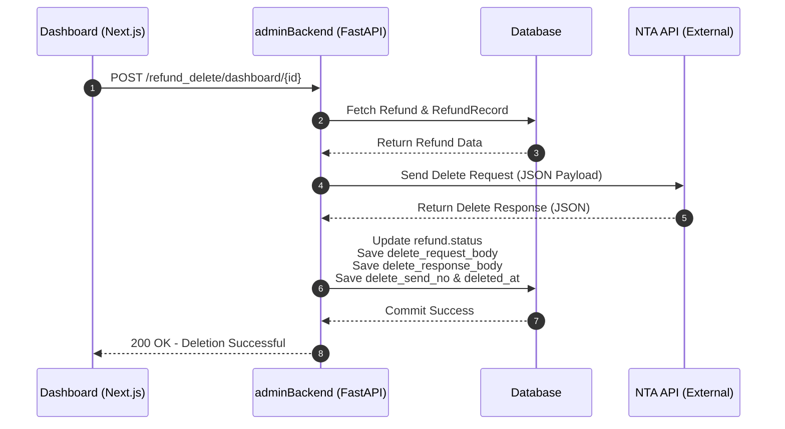
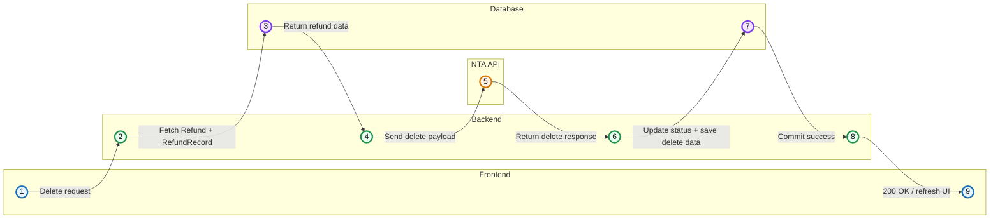
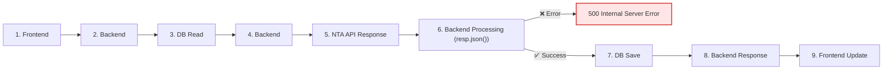

### 削除処理のフロー

1. フロントエンドから `/refund_delete/dashboard/{id}` へ POST リクエストを送信。
2. バックエンドはデータベースから Refund と RefundRecord を取得。
3. 取得した情報を基に国税庁（NTA）APIへ削除リクエストを送信。
4. NTA API から削除レスポンスを受信。
5. バックエンドは以下の情報をデータベースへ保存：
   - refund.status
   - delete_request_body
   - delete_response_body
   - delete_send_no
   - deleted_at
6. データベースの保存完了後、バックエンドがフロントエンドへ成功レスポンスを返却。




```python
 try:
    refund.status = "cancelled"
    session.add(refund)
    
    refund_record.delete_request_body = encrypt(request_body)
    #  国税庁（NTA）APIのレスポンスが空または非JSONの場合に
    # resp.json() でパースエラーが発生するため、
    # 安全にJSON形式へ変換してから暗号化し、DBへ保存する。
    # The error occurs because the backend assumes the NTA API response is always valid JSON.
    # When the response is empty or not JSON, resp.json() fails, leading to a 500 Internal Server Error.


　　# 原因：
　　# レスポンスが空またはJSON形式でない場合、resp.json() が失敗し、
　　# encrypt(resp.json()) の処理で500エラーが発生する。
    refund_record.delete_response_body = encrypt(resp.json())

    refund_record.delete_send_no = newSendNo
    refund_record.deleted_at = datetime.now()
    session.add(refund_record)
    session.commit()
    session.refresh(refund_record)
    session.refresh(refund)
    
  except Exception as e:
    session.rollback()
    raise HTTPException(status_code=500, detail=f"Error saving delete refund to DB: {str(e)}")

```


### 解決策：

```python
    # NTA APIのレスポンスを安全に処理する
    # レスポンスがJSON形式であればそのまま保存し、
    # 空または非JSONの場合は、ステータスコードや生のテキストを保存する。
    response_body = {}

    if resp.text and resp.text.strip():
        try:
            # JSON形式の場合
            response_body = resp.json()
        except Exception:
            # JSONでない場合
            response_body = {
                "status_code": resp.status_code,
                "content_type": resp.headers.get("Content-Type"),
                "raw_text": resp.text,
            }
    else:
        # レスポンスが空の場合
        response_body = {
            "status_code": resp.status_code,
            "content_type": resp.headers.get("Content-Type"),
            "message": "empty response",
        }

    # 安全に処理したレスポンスを暗号化して保存
    refund_record.delete_response_body = encrypt(response_body)

```


