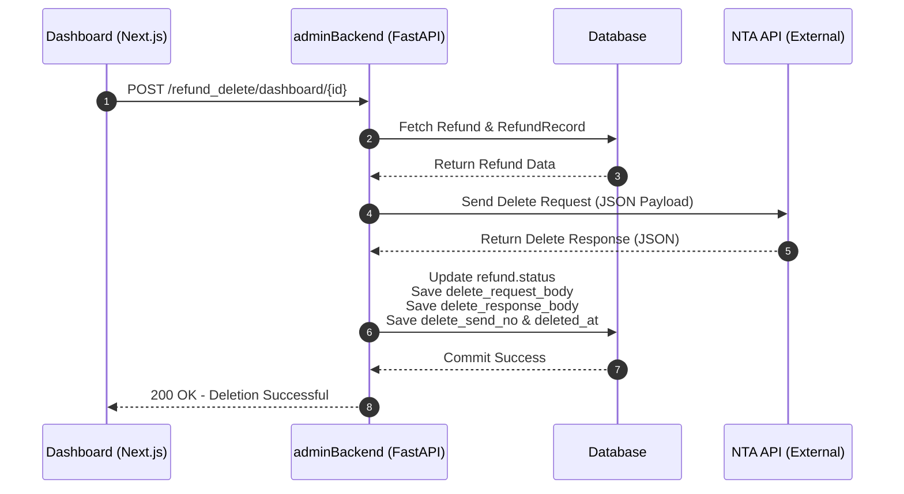
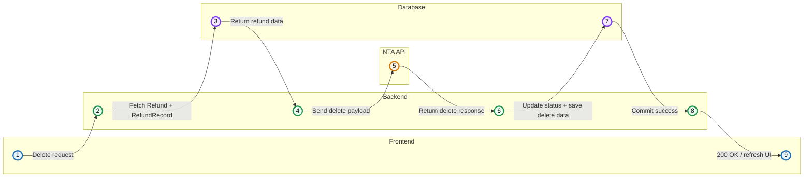

### 削除処理のフロー

1. フロントエンドから `/refund_delete/dashboard/{id}` へ POST リクエストを送信。
2. バックエンドはデータベースから Refund と RefundRecord を取得。
3. 取得した情報を基に国税庁（NTA）APIへ削除リクエストを送信。
4. NTA API から削除レスポンスを受信。
5. バックエンドは以下の情報をデータベースへ保存：
   - refund.status
   - delete_request_body
   - delete_response_body
   - delete_send_no
   - deleted_at
6. データベースの保存完了後、バックエンドがフロントエンドへ成功レスポンスを返却。
